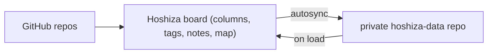

# Hoshiza

A GitHub triage board for people with too many repos: drag them across your own status columns, tag and annotate, and keep the state synced across devices with no server of your own.

> Hoshiza (星座) is Japanese for "constellation": fitting for keeping track of your own little galaxy of repos :3

## How it works



Your triage state is a single JSON file pushed to a private `hoshiza-data` repo on your own GitHub account, a few seconds after you stop editing. The browser holds the working state, GitHub holds the backup, and that's the whole stack: the only server involved is a tiny Cloudflare Worker that brokers the OAuth handshake.

## Features

- **Board & Map** - drag cards between your columns, or zoom out and see everything as a network graph
- **Custom statuses** - rename, recolor, and reorder columns to fit how you actually triage
- **Tags & notes** - annotate repos as you go
- **Smart defaults** - new repos get a suggested status based on activity, so nothing lands unread
- **Filters** - by language, owner, archived/fork status, plus free-text search
- **Auto-sync** - state pushed to `hoshiza-data` on an autosync timer; last-writer-wins across devices
- **Self-updating** - every push to `main` is publishable, and the app hot-swaps itself commit-by-commit via my own [Updato](https://github.com/NellowTCS/updato), no reload needed
- **PWA** - installable, auto-updating

## Why a Worker?

GitHub can't do the OAuth dance from a browser alone: the token exchange needs a client secret, and GitHub blocks CORS at that endpoint. So a small Cloudflare Worker holds the secret and does three things:

1. `/login` sends you to GitHub with a random state cookie; `/callback` exchanges the code server-side and drops the token in an `HttpOnly` cookie scoped to the Worker.
2. `/api/github?path=...` proxies GitHub API calls using that cookie. The token never reaches the browser, let alone the app origin.
3. `/logout` clears the cookie.

The Worker requests the `repo` scope at login on purpose: without it GitHub only exposes public repos, and the board would report perfectly alive private repos as deleted. Learned that one the hard way.

Because the cookie is `SameSite=None` and the app and Worker live on different origins, CORS is all that stops a random site from driving the proxy as you. So it's locked down twice:

- The Worker only echoes credentialed origins that belong to the app (`APP_URL` plus the localhost dev ports, or extra ones via `APP_ORIGINS`). A foreign `Origin` header never gets echoed, so the browser refuses to hand over responses.
- The proxy only allows the API paths the app actually uses: identity/org/repo reads, GraphQL, and the single write: the state file in `hoshiza-data`. Everything else is a 403 before it ever reaches GitHub.

## Development

Two terminals:

```sh
cd Backend && npm install && npm run dev    # Worker on :8787
cd Build && npm install && npm run dev      # client on :5173
```

Point the client at the local Worker in `Build/.env.development`:

```
PUBLIC_WORKER_URL=http://localhost:8787
```

Then log in. Since the OAuth app is in Dev mode, orgs you belong to may need to approve it for private-repo access before their repos show up on the board.

### Worker environment

`GITHUB_CLIENT_SECRET` is a deploy secret; the rest are vars.

| Var                    | Purpose                                 | Default                        |
| ---------------------- | --------------------------------------- | ------------------------------ |
| `GITHUB_CLIENT_ID`     | Public OAuth app id                     | -                              |
| `GITHUB_CLIENT_SECRET` | OAuth app secret (deploy secret)        | -                              |
| `APP_URL`              | Deployed app origin + base path         | `https://nellowtcs.me/Hoshiza` |
| `APP_ORIGINS`          | Extra CORS-allowed origins (optional)   | none                           |

## Repository layout

```txt
Hoshiza/
  Backend/        # Cloudflare Worker (OAuth broker + API proxy)
    src/worker.ts
    tests/        # vitest: sanitizers, CORS allow-list, path allow-list
  Build/          # SvelteKit client (static build)
    src/lib/      # state, api, repo cache, components
```

## Tests

```sh
cd Backend && npm test
```

Both halves type-check with `npm run check`.

## Deployment

- Worker: `cd Backend && npm run deploy` (with the env vars above)
- Client: `cd Build && npm run build`, then ship the `build/` output anywhere static. `PUBLIC_WORKER_URL` is baked into the build, defaulting to `https://hoshiza.neeljaiswal23.workers.dev`.

## License

MIT. See [LICENSE](LICENSE).
